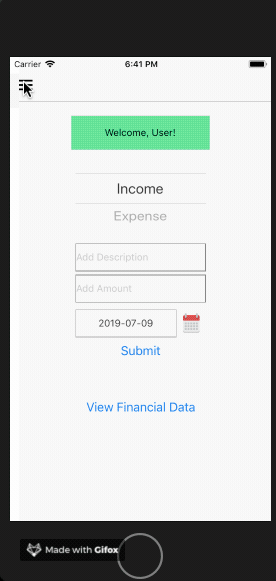

# react-native-finance-app

Documenting work in progress 

Updates from 7/9.

Added drawer navigation, tab navigation, and stack navigators to make app a bit more user friendly. 
Next step is to increase UI/ UX functionality and to be able to save/ delete data locally using async storage
and/ or NoSQL DB. 
 
